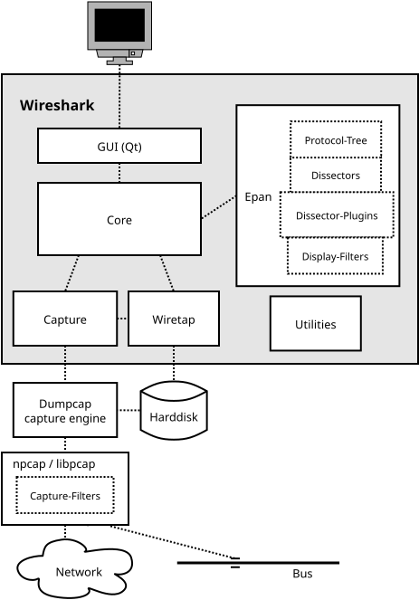

# Wireshark Information

Some wireshark notes (including writing lua dissectors) that I'm taking so I have all the references in one place.

- [Wireshark Information](#wireshark-information)
  - [Videos:](#videos)
  - [Wireshark Architecture Block Diagram](#wireshark-architecture-block-diagram)
  - [Wireshark Docs:](#wireshark-docs)
    - [Official Docs](#official-docs)
    - [Official Videos](#official-videos)
    - [Lua-Specific resources](#lua-specific-resources)
    - [Sample Captures to Work With](#sample-captures-to-work-with)
    - [My Docs](#my-docs)
    - [Other Docs](#other-docs)
  - [Dissectors](#dissectors)
    - [Videos](#videos-1)
    - [3rd Party Git Repos and Docs](#3rd-party-git-repos-and-docs)

## Videos:

## Wireshark Architecture Block Diagram

## Wireshark Docs:
### Official Docs
[User Guide - One Page](https://www.wireshark.org/docs/wsug_html/)  
[Dev Guide - One Page](https://www.wireshark.org/docs/wsdg_html/)  

[Hansang Bae Traces Files](https://app.box.com/v/HSBBook)

### Official Videos
[Sharkfest Videos](https://www.youtube.com/channel/UCHBY7sUVdWK4bOSe7khG0UA)

### Lua-Specific resources
[Dev Guide - Lua Intro](https://www.wireshark.org/docs/wsdg_html/#wsluarm)  
[Dev Guide - Lua API](https://www.wireshark.org/docs/wsdg_html/#wsluarm_modules)
[Wireshark Gitlab Wiki Link](https://gitlab.com/wireshark/wireshark/-/wikis/home)

[Lua Examples - Wiki](https://wiki.wireshark.org/Lua/Examples)
[Lua Post-Dissector](https://wiki.wireshark.org/Lua/Examples/PostDissector)
[Lua Contrib](https://gitlab.com/wireshark/editor-wiki/-/wikis/Contrib)
[Peter Wu Postdissector Example](https://gist.github.com/Lekensteyn/288ea8c2f8efdf87819f8489a75b5475)
[Peter Wu Gists](https://gist.github.com/Lekensteyn)
[Lua Post-Dissector Filter Cols](https://wiki.wireshark.org/Lua/Examples/filtcols)

[Using Wireshark Lua Standalone](https://osqa-ask.wireshark.org/questions/30507/use-wiresharks-lua-interpreter-stand-alone/)
[Wirebait](https://github.com/MarkoPaul0/WireBait)

### Sample Captures to Work With
[Wireshark Sample Captures - Gitlab](https://gitlab.com/wireshark/wireshark/-/wikis/SampleCaptures)
[Wireshark Contrib Page - Gitlab](https://gitlab.com/wireshark/wireshark/-/wikis/Contrib)
**Important!**[Chris Maynard - Dissector 101 - Lua and C "Foo" Protocol](https://www.wireshark.org/lists/wireshark-dev/202110/msg00008.html)

### My Docs
[Wireshark For Beginners Notes](wireshark_for_beginners.md)
[Lua Dissector Info](lua_dissectors.md)

### Other Docs
**Important!**[Tshark Dev Guide](https://tshark.dev/)

## Dissectors

### Videos
[Extending Wireshark with Lua](https://www.youtube.com/watch?v=wG0tN9BDh1A)
[Lua Programming for Wireshark](https://www.youtube.com/playlist?list=PLedx6HwQji1O-SHD3_lCdSxMUT56d5y9Y)

### 3rd Party Git Repos and Docs
[Mikas Tech Blog - Dissector HOWTOs](https://mika-s.github.io/topics/)
[Hadriel Kaplan - DNS Dissector lua](https://github.com/wireshark/wireshark/blob/master/test/lua/dissector.lua)
[Multi-Layer Dissector](https://ask.wireshark.org/question/20217/how-to-create-multi-layer-lua-dissector/)
[Didier Stevens](https://blog.didierstevens.com/2014/05/12/video-packet-class-wireshark-lua-protocol-dissectors/)
[Kaos Lua Wireshark](https://github.com/kaos/wireshark-plugins)
[Katai Struct to Lua](https://github.com/joushx/kaitai-to-wireshark)
