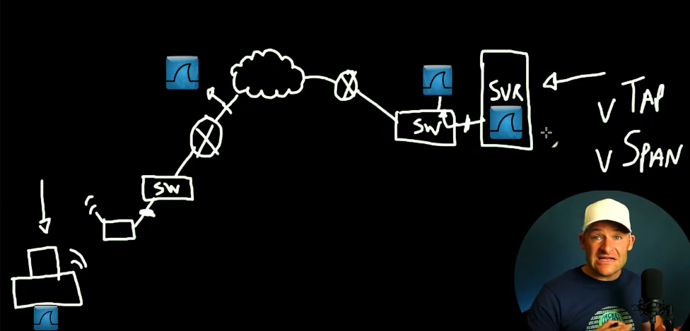
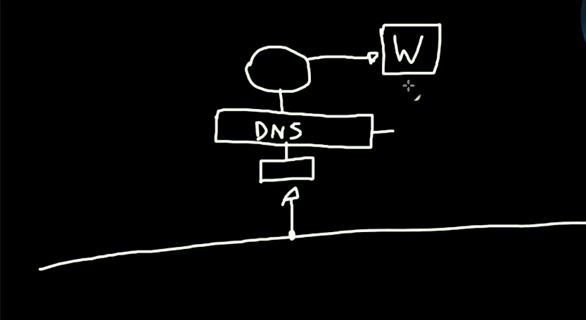

# Wireshark for Beginners

- [Wireshark for Beginners](#wireshark-for-beginners)
  - [Playlist](#playlist)
    - [Video 1 - Where to Start](#video-1---where-to-start)
      - [Profiles](#profiles)
      - [Things Done:](#things-done)
    - [Video 2 - Capturing Traffic](#video-2---capturing-traffic)
      - [Packet Capture Driver](#packet-capture-driver)
      - [Interfaces](#interfaces)
    - [Video 3 - Packet Capture from the command line](#video-3---packet-capture-from-the-command-line)
      - [CLI Tools](#cli-tools)
    - [Video 4 - Where do we capture network traffic?  How?](#video-4---where-do-we-capture-network-traffic--how)
    - [Video 5 - Filtering](#video-5---filtering)
      - [Capture Filters](#capture-filters)
      - [Display Filters](#display-filters)
    - [Video 6 - Name Resolution](#video-6---name-resolution)
      - [Name Resolution](#name-resolution)

## Playlist
[Wireshark for Beginners](https://www.youtube.com/watch?v=OU-A2EmVrKQ&list=PLW8bTPfXNGdC5Co0VnBK1yVzAwSSphzpJ)

### Video 1 - Where to Start
[Standalone Video Link](https://www.youtube.com/watch?v=OU-A2EmVrKQ)
[Capture File Used](captures/Wireshark_Masterclass_Lesson1_Setup.pcapng)

#### Profiles
Creating custom profiles allows you to set / recall things based on a profile setup.

* Bottom right corner of UI window
* Right-click:
  * Create new
  * Manage

Creating a profile allows you to setup wireshark for a particular analysis "type".  So for example, if you want to examine just "work-related" packets, create a "work" profile, and then configure wireshark for that workflow.  

Perhaps you might want to create a profile just for basic TCP analysis, or one for a custom protocol, or one with a particular layout and zoom level, etc.  Custom profiles allow you to do this easily.

#### Things Done:
1. Created & Configured New Profile
   * Bottom right corner
     * Right-click "Profile"
     * Create New
       * Give it a name
  
2. Adjusted the layout
   * Packet View!
   * Changing the layout of the panes
3. Added a delta time column
   * Edit->Preferences->Appearance->Columns
     * "Plus/Add"
     * Title="Delta"
     * Type="Delta time displayed"
     * Move after "Time" column
4. Creating Coloring Rules
   * View -> Coloring Rules
   * Create a rule just like you would a new column
     * Ordering of the rules matters! E.g. put a SYN coloring rule under any retransmission rules to still get the black/red coloring.
5. Creating & Saving Display Filter Buttons
   * Select the packet in packet list
   * Right-click the field you want to filter on in packet details
     * Prepare as Filter->Selected
   * This will add the filter to the filter bar.
     * Click the plus to the right of the display filter bar
     * Give it a name (like "TCP SYN")
     * Check the filter rule
     * Click ok - now you've got a button.
6. Adding Columns
   * Right click on some field in the packet details pane you want to add
   * Select "Apply as column"
   * **Note:**"Length" column is the **frame length** not the payload length

### Video 2 - Capturing Traffic
[Standalone Video](https://www.youtube.com/watch?v=nWvscuxqais)
[Capture File]()

#### Packet Capture Driver
* Packet Driver / Capture Library:
  * Windows: usually npcap of some version
  * Linux/Mac: usually libpcap (npcap is based off libpcap)
  * Help->About Wireshark  (look for "libpcap or npcap version")

#### Interfaces
If you don't see any interfaces, you may not have permissions, or have not been added to the capture group (this happens on ubuntu for sure - had to do some things to get this working as "normal user")

**Setting up your Capture Interfaces**
  * Capture->Options...
  * "Manage Interfaces..."
    * Filter the list to ones you know you'll be using to keep things simple
    * Applies to the active profile

* Snaplen is a setting that allows you to control the length of the frame data you're capturing.
  * So, if you're in a secure environ, you can just grab header information (for example), by setting snaplen to 64 (or similar)

* Buffer is the allocation of kernel / process memory for this capture.
  * 2MB is usually fine unless you're in a super-high throughput environment
  
* "Enable Promiscuous Mode on all Interfaces" 
  Allows to capture unicast traffic from machines talking to one another as well

* Output tab:
Longer term file storage - splitting pcaps into smaller files
  * Configure place where pcapngs are stored
    * Select a location and file name
  * Setup a ring-buffer
  * Setup file sizes for the ring buffer (e.g. 10MB, etc.)

### Video 3 - Packet Capture from the command line
[Standalone Video](https://www.youtube.com/watch?v=DAtyzE1TUlI)
[Capture File]()

#### CLI Tools
* dumpcap: the capture engine used for wireshark / tshark - modern
  * CANNOT see non-physical interfaces like extcap 
* tcpdump: older traffic capture, no gui, different filter syntax and packet capture format
  
```bash
$dumpcap -D #list interfaces
$dumpcap -i 1 #capture from interface 1
ctrl-c # stop the capture
$dumpcap -i 1 -w ~/data/sample.pcapng  # write from interface 1 to sample.pcapng
```

Ringbuffer type things:
```bash
#100MB files, 10 of them
$dumpcap -i 1 -w ~/data/sample.pcapng -b filesize:100000 -b files:10
```

### Video 4 - Where do we capture network traffic?  How?
[Standalone Video](https://www.youtube.com/watch?v=Atde35_9AAc)
[Capture File]()

[Taps & Insertion Points](./images/video4-taps-insertion%20points.png)


Avoid installing wireshark (generally) on the client having an issue, or the server endpoint.  Must be well aware of loads on either end (and if client is having issues - don't want to add to it's load)



**Question:** What is a tap or span?  What is a vTap or vSpan?  Are they physical devices?
**Answer:**

### Video 5 - Filtering
[Standalone Video](https://www.youtube.com/watch?v=-HDpYR_QSFw)
[Capture File](./captures/from_my_network.pcapng)

#### Capture Filters



Capture filters operate on the NIC level, and only capture specific types of traffic
-------------NetworkPoint-----------
                   |
                  NIC
                   |
                PROTO (e.g. DNS) -> Capture Buffer
                   |
                Wireshark -> Display Filters

Capture filters use a different language then display filters.  
Capture filters are much much simpler than display filters.
**Note:** don't make your capture filters too narrow - you may miss important details (or where the problem actually gets started by)

#### Display Filters
Work after to further filter (only display) the filtered capture traffic

**Learn to love the right-click to use "Prepare as Filter" and "Apply as Filter"**  it's very handy (and quick)

Display filter "workflow" possibility:
endpoint->conversation->port number/application-proto values

* Protocol filter
  * "arp" in filter bar
  * "ip" - includes all udp, tcp, but no ipv6
  * "ip.addr==192.168.4.35"
* Conversation filter
  * ip.addr eq 142.251.40.100 and ip.addr eq 192.168.4.35
  * right-click on the endpoint you want to filter on, and select the conversation filter and the filter sub-type (layer)
* TCP filter
  * manually: (ip.addr eq 142.251.40.100 and ip.addr eq 192.168.4.35) and tcp  << added in () and "and tcp">>
  * **or, better**: with existing conversation filter, right click in packet details on "Transmission Control Protocol", select "Prepare as filter" and some logical condition (e.g. "and selected")
* Progressive Removal, e.g.:
  * "not arp"
  * "not (arp or ipv6)"
* TCP port filter on several different TCP ports 
  * tcp.port in {80,443,8080}
* Text Strings
    * Contains (case-specific)
      * frame contains "google"
    * matches (case-insensitive)
      * frame matches "Google"

### Video 6 - Name Resolution
[Standalone Video](https://www.youtube.com/watch?v=gfxxCBCKvMU)
[Capture File](./captures/Wireshark_Masterclass_Lesson6_Naming.pcapng)

#### Name Resolution
